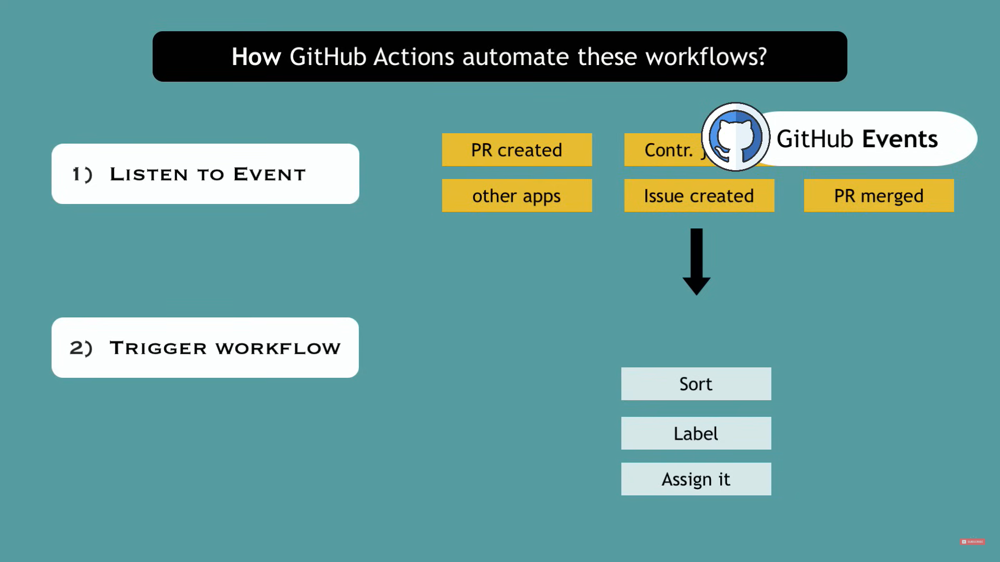
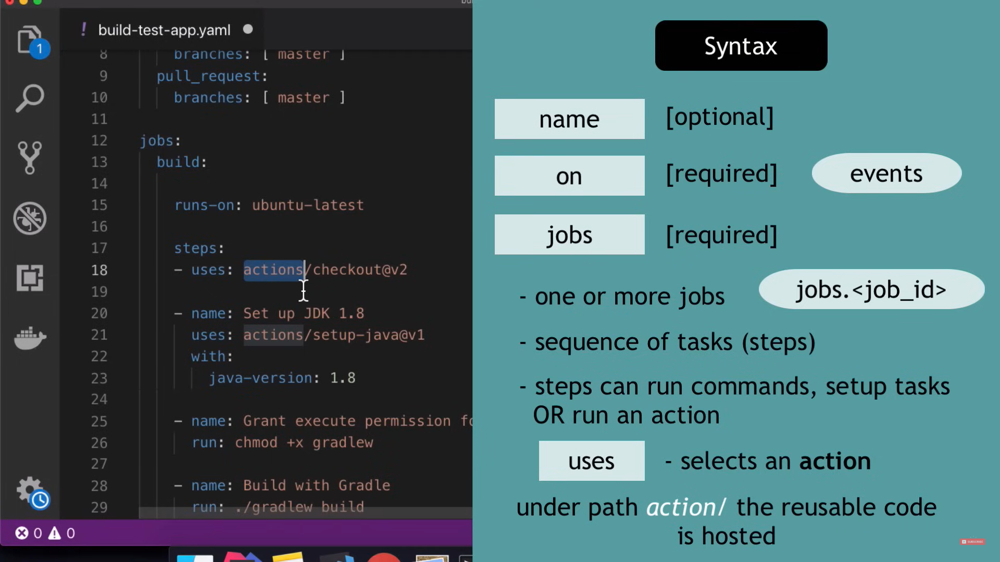

# `Types of Workflow Triggers`

Workflow triggers can be events that occur in the workflow's repository, events that occur outside of GitHub, scheduled times, or manual triggers. Workflow triggers are defined using the `on` key.

## Triggering Workflows

When an event occurs, GitHub searches the `.github/workflows` directory for workflow files associated with the event's commit SHA or Git ref. A workflow run is triggered for any workflows that have `on:` values that match the triggering event. Some events also require the workflow file to be present on the default branch to run. When a workflow runs, GitHub sets the `GITHUB_SHA` (commit SHA) and `GITHUB_REF` (Git ref) environment variables.

## Triggering Workflows from Workflows

Events triggered by the `GITHUB_TOKEN` will not create a new workflow run, to prevent recursive workflow runs. You can use a GitHub App installation access token or a personal access token to trigger events that require a token. To minimize costs, ensure you don't create recursive or unintended workflow runs.

## Configuring Workflow Triggers

Use the `on` key to specify what events trigger your workflow. You can use activity types and filters to further control when your workflow will run. You can use filters to target specific branches, tags, or file paths for the `push` and `pull_request` events. The order of patterns in filters is important, as negative patterns can exclude Git refs that positive patterns include.

## Manually Triggered Workflows

When using the `workflow_dispatch` event, you can define inputs that are passed to the workflow.

## Reusable Workflows

You can define inputs, secrets, and outputs for reusable workflows.

## Using Event Information

Information about the event that triggered a workflow is available in the `github.event` context. You can use this information to control how your workflow runs.

# `Using Conditions to Control Job Execution`

## Prevent a Job from Running Unless Your Conditions Are Met

### Skipped Job Behavior

- A job that is skipped will report its status as "Success".
- A skipped job will not prevent a pull request from merging, even if it is a required check.

### Conditional Job Execution

- You can use the `jobs.<job_id>.if` conditional to prevent a job from running unless a condition is met.
- You can use any supported context and expression to create a conditional.
- The `jobs.<job_id>.if` condition is evaluated before `jobs.<job_id>.strategy.matrix` is applied.
- When using expressions in an `if` conditional, you can omit the `${{ }}` syntax, but this exception does not apply everywhere.
- You must always use the `${{ }}` syntax or escape with `'`, `"`, or `()` when the expression starts with `!`, as `!` is reserved notation in YAML format.

### Example: Restricting Job to Specific Repository

The example uses the `if` conditional to only run the `production-deploy` job if the repository is named `octo-repo-prod` and is within the `octo-org` organization. If the condition is not met, the job will be marked as skipped.

### Using Environment Variables

- In some parts of the workflow, you cannot use environment variables directly.
- Instead, you can use contexts to access the value of an environment variable.

 
 

# `Running jobs in a container`

## Use a container to run the steps in a job

### Defining the Container

- Use `jobs.<job_id>.container` to create a container to run any steps in a job that don't already specify a container.
- If you have steps that use both script and container actions, the container actions will run as sibling containers on the same network with the same volume mounts.
- If you do not set a container, all steps will run directly on the host specified by `runs-on` unless a step refers to an action configured to run in a container.
- The default shell for run steps inside a container is `sh` instead of `bash`, which can be overridden with `jobs.<job_id>.defaults.run` or `jobs.<job_id>.steps[*].shell`.

### Configuring the Container

- Specify the Docker image to use as the container with `jobs.<job_id>.container.image`.
- Provide credentials for a private container registry using `jobs.<job_id>.container.credentials`.
- Set environment variables in the container using `jobs.<job_id>.container.env`.
- Expose network ports on the container using `jobs.<job_id>.container.ports`.
- Mount volumes in the container using `jobs.<job_id>.container.volumes`.
- Configure additional Docker container resource options using `jobs.<job_id>.container.options`.

Note: The `--network` and `--entrypoint` options are not supported.

